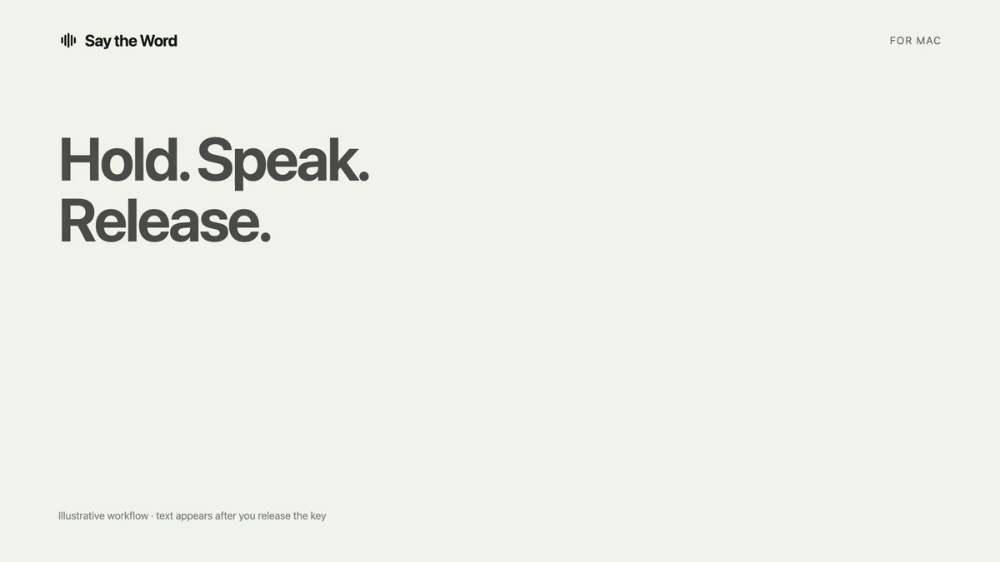
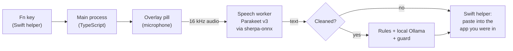

<div align="center">

[](docs/media/say-the-word-demo.mp4)

# Say the Word

**Hold a key, speak, and your words land where you were typing. Nothing leaves your Mac.**

Free, open-source dictation for macOS. Speech recognition runs on your Mac, an optional local model tidies the text, and no audio or transcript is ever sent anywhere.

<a href="https://github.com/yravinderkumar33/say-the-word/releases/latest/download/Say-the-Word-arm64.dmg"></a>

[](https://github.com/yravinderkumar33/say-the-word/releases/latest)
[](LICENSE)


[Watch the 36-second video](docs/media/say-the-word-demo.mp4) · [Features](#features) · [Privacy](#privacy-in-plain-terms) · [Install](#install)

</div>

---

## Why Say the Word

Voice typing is one of the biggest productivity tools on a computer, and for people with RSI, carpal tunnel, dyslexia, limited mobility or chronic pain it may be the only comfortable way to write. The best dictation tools usually send every word you say to someone else's server, on a subscription. The ones built into the OS are private, but give you little control.

Say the Word gives you fast hold-to-talk dictation in every app, with **every step running on your own Mac**:

- **Private by design.** No account, no cloud, no telemetry. Your voice and your text stay on your Mac.
- **Fast.** In Verbatim mode, text appears about 0.4 seconds after you let go of the key.
- **Works everywhere you type.** Mail, Slack, Notes, your browser, your code editor.
- **Works offline.** After a one-time model download, it needs no internet.
- **Open source.** MIT-licensed: anyone can read the code and check every privacy claim.

## Features

- **Hold to talk.** Hold `Fn`, speak, let go: the text is pasted at your cursor.
- **Hands-free.** Press `Fn` twice (or `Fn`+`Space`, or click the pill) and speak with no key held. Press `Fn` again to stop.
- **Cleaned mode.** A local [Ollama](https://ollama.com) model removes "um", false starts and repeated words. A guard checks every result: if the model is slow or changes a number, a name or a "not", you get a rules-only cleanup instead, on time.
- **Verbatim mode.** Exactly what you said, with punctuation and capitals.
- **Your text is never lost.** `Esc` cancels and Undo brings it back. `Cmd`+`Ctrl`+`V` pastes your last dictation again. If a paste can't happen, the pill offers Copy.
- **Safe with passwords.** When macOS reports a password field, the app never pastes automatically.
- **Your choice of key.** No `Fn` key, or another app already uses it? Use `Control`+`Option` instead.
- **History you control.** See what was heard beside what was written, and how long each step took. Kept in memory only, unless you choose to save it.
- **Made for everyone.** Light and dark appearance, a guided first run, and support for VoiceOver, Increase Contrast, Reduce Motion and Reduce Transparency. Everything also works from the menu bar.

<table>
<tr>
<td width="50%"></td>
<td width="50%"></td>
</tr>
<tr>
<td><sub><b>Home:</b> the mode, the microphone, the gestures and your recent dictations.</sub></td>
<td><sub><b>History:</b> what was heard beside what was written, and how long each step took.</sub></td>
</tr>
<tr>
<td></td>
<td></td>
</tr>
<tr>
<td><sub><b>Cleanup:</b> choose Verbatim or Cleaned, and compare them.</sub></td>
<td><sub><b>Privacy:</b> what is stored, and every address the app has contacted, read live.</sub></td>
</tr>
</table>

## Privacy, in plain terms

|                 |                                                                                                                                                                    |
| --------------- | ------------------------------------------------------------------------------------------------------------------------------------------------------------------ |
| **Audio**       | The microphone is on only while you dictate. Audio is turned into text on your Mac and **never written to disk**.                                                  |
| **Transcripts** | Kept in memory until you quit. To keep them for 7 days, 30 days or until you delete them, you choose it, and macOS asks you to confirm before anything is written. |
| **Network**     | **None in Verbatim mode.** Cleaned mode talks only to Ollama on your own Mac (`127.0.0.1`). The speech model is downloaded once, when you ask.                     |
| **Logs**        | Record what happened (key presses, states, why a paste was refused), **never what you said**.                                                                      |
| **Deleting**    | The Privacy page lists everything stored, with its size, and deletes any of it.                                                                                    |

These rules are enforced in code and covered by tests: see [Architecture and behaviour](docs/02-architecture-and-behaviour.md).

## Install

**[Download Say the Word](https://github.com/yravinderkumar33/say-the-word/releases/latest/download/Say-the-Word-arm64.dmg)** for macOS 14 or later on Apple Silicon (M1 or later). It is signed and notarized by Apple.

1. Open the DMG and drag **Say the Word** into Applications.
2. Open it from Applications. It lives in the menu bar, and a setup guide opens on the first launch.
3. Allow **Microphone** and **Accessibility** access when asked (Accessibility lets it paste for you). The speech model downloads once, about 670 MB.
4. Click into any text field, hold `Fn`, speak, and let go.

**Optional, for Cleaned mode:** install [Ollama](https://ollama.com), run `ollama pull qwen3.5:4b`, and pick the model on the Cleanup page.

Updates are not automatic yet. To update, download the latest release and replace the app; your settings and any history you chose to save stay. If you use another dictation app that listens to `Fn`, quit it first: two apps on the same key will fight over it.

## FAQ

**Is it really free?** Yes. It is MIT-licensed, with no account, no subscription and no paid tier.

**Does it work on Intel Macs?** No. It needs Apple Silicon (M1 or later) and macOS 14 or later.

**Which languages does it understand?** The speech model, NVIDIA's [Parakeet v3](https://huggingface.co/nvidia/parakeet-tdt-0.6b-v3), recognizes 25 European languages, including English, French, German, Spanish and Italian. The cleanup rules are tuned for English.

**A dictation didn't arrive. What happened?** The pill says why in a few words, and the History page explains it, with what you can do about it. Your text is never lost: use Copy on the pill, or press `Cmd`+`Ctrl`+`V` to paste your last dictation. The log (menu-bar icon › **Show Log**) has the details, and never contains what you said.

**It says "Secure Input is on: nothing was pasted".** macOS reports that the app in front is taking a password, so automatic paste is refused. If your cursor isn't in a password field, macOS or that app has left Secure Input on. Copy the text from the pill and paste it yourself.

## How it works



- **Electron and TypeScript** hold all the product logic. A small **Swift helper** does what JavaScript can't: seeing the `Fn` key, posting the paste, reading Accessibility.
- **Speech recognition:** [Parakeet TDT 0.6b v3](https://huggingface.co/nvidia/parakeet-tdt-0.6b-v3) (int8) on the CPU through [sherpa-onnx](https://github.com/k2-fsa/sherpa-onnx), in its own process, with Silero voice activity detection.
- **Cleanup:** fast rules first, then an optional local model with a fixed time limit and a guard that rejects any change of meaning.
- **Storage:** history in SQLite in a separate process, so a slow disk never delays a paste.

Measured on an Apple M4 with 16 GB ([benchmarks](docs/benchmarks.md)):

| Measure                                  | Result                        |
| ---------------------------------------- | ----------------------------- |
| Key press to microphone live             | median **108 ms**, p95 119 ms |
| Key release to text pasted, Verbatim     | median **402 ms**, p95 448 ms |
| Key release to text pasted, Cleaned (4B) | median about **0.9 s**        |

## Build from source

You need macOS 14+ on Apple Silicon, Node 22.13+, and the Xcode command-line tools (Swift 6).

```sh
git clone https://github.com/yravinderkumar33/say-the-word.git
cd say-the-word
npm install
npm run models:download   # the speech model, about 670 MB, once
npm run dev               # builds the Swift helper and starts the app with hot reload
```

In development, macOS gives the Microphone and Accessibility permissions to the terminal that started the app. To test them as a user would, build a signed app: `npm run setup:signing` once, then `npm run pack`, then open `dist/mac-arm64/Say the Word Dev.app`.

| Command            | What it does                                                                                     |
| ------------------ | ------------------------------------------------------------------------------------------------ |
| `npm run check`    | Type-check, lint, format check, nearly 1,200 unit tests and 120 Swift tests. Run before every PR |
| `npm run test:app` | Whole dictations in the running app, with injected faults; never touches your keyboard           |
| `npm run test:e2e` | The real key tap and paste into TextEdit (takes keyboard focus for about 45 s)                   |
| `npm run pack`     | A signed, verified `.app` in `dist/`                                                             |
| `npm run release`  | The notarized DMG (needs a Developer ID certificate)                                             |

The design and the decisions behind it are in [`docs/`](docs): [research and decisions](docs/01-research-and-decisions.md), [architecture](docs/02-architecture-and-behaviour.md), [implementation reference](docs/04-implementation-reference.md), and the [progress log](docs/progress.md).

## Roadmap

- [ ] A "Check for updates" button that respects the network policy
- [ ] More languages through a Whisper-based engine
- [ ] Windows and Linux (the key, paste and speech parts are already behind interfaces)

## Contributing

Contributions are welcome, especially:

- **Testing on other Macs, keyboards and apps.** Paste behaviour differs between editors, browsers and terminals. A log excerpt and the app's name help a lot.
- **Accessibility feedback** from people who use VoiceOver or rely on dictation every day.
- **Better cleanup rules**, and better ways to measure Cleaned mode.

[Open an issue](https://github.com/yravinderkumar33/say-the-word/issues) for a bug or an idea. Before a pull request, run `npm run check` and read the working agreements in [`CLAUDE.md`](CLAUDE.md). The privacy rules are requirements: never log what was said, use no network beyond the local Ollama and downloads the user starts, and copy no code from GPL or AGPL projects.

## Acknowledgements

Say the Word builds on excellent open work: [sherpa-onnx](https://github.com/k2-fsa/sherpa-onnx), NVIDIA's [Parakeet](https://huggingface.co/nvidia/parakeet-tdt-0.6b-v3), [Ollama](https://ollama.com), [Electron](https://www.electronjs.org), React and Tailwind CSS. The native layer learned from these MIT-licensed dictation projects: [Amical](https://github.com/amicalhq/amical), [OpenWhispr](https://github.com/OpenWhispr/openwhispr), [Handy](https://github.com/cjpais/Handy), [hive](https://github.com/morapelker/hive) and [dictation-cleanup-rules](https://github.com/AbhishekBarali/dictation-cleanup-rules). Every component and its licence is listed on the app's About page.

Say the Word is an independent project, not affiliated with Wispr Flow or any other dictation product.

## Licence

[MIT](LICENSE)
