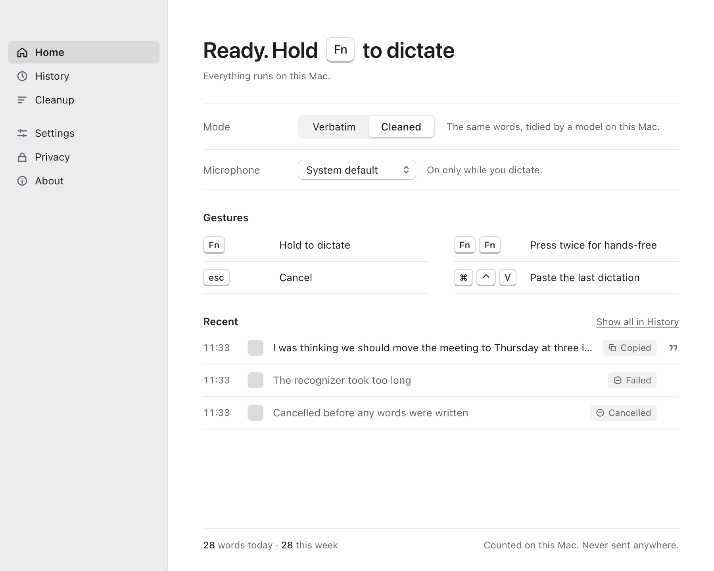
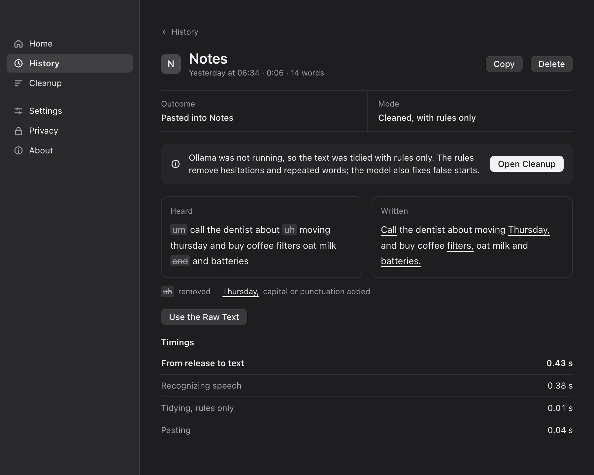
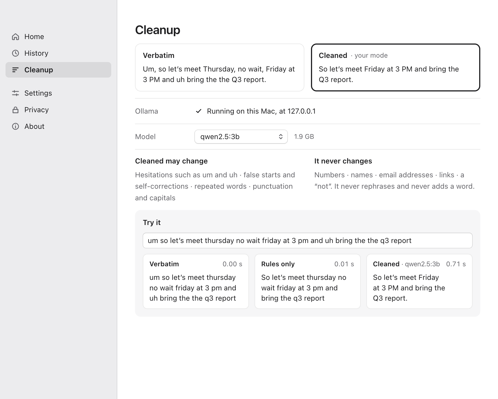
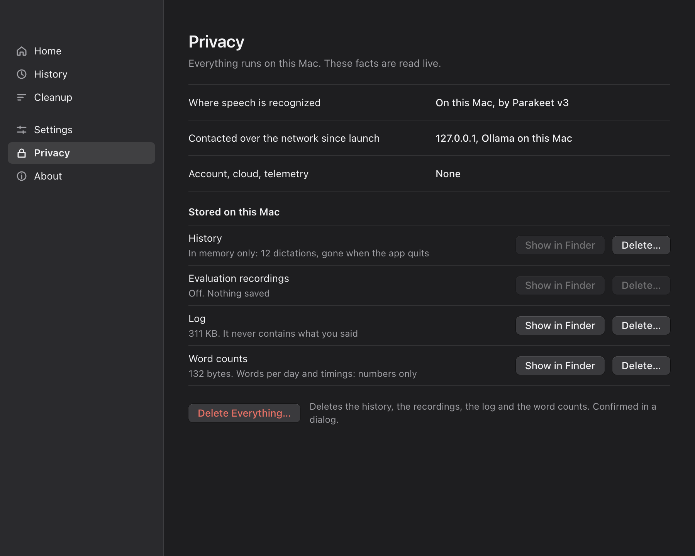
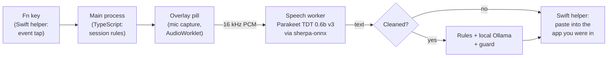

<div align="center">


# Whisper Flow

**Hold a key, speak, and your words land where you were typing. Nothing leaves your Mac.**

Open-source, local-first dictation for macOS. Speech recognition runs on your machine, an optional local model tidies the text, and no audio or transcript is sent anywhere.

[](LICENSE)


</div>

---

## Why this exists

Voice typing is one of the biggest productivity tools on a computer. For people with RSI, carpal tunnel, dyslexia, limited mobility or chronic pain, it may be the only comfortable way to write. Today the best dictation tools usually work one of two ways:

- **In the cloud.** Every word you say (emails, medical notes, passwords read aloud, private messages) goes to someone else's server, usually on a subscription.
- **Built into the OS.** These are private, but you have little control over them, cleanup is limited, and they often lag behind the cloud tools.

Whisper Flow aims for both: the fast hold-to-talk interaction of the best commercial dictation apps, with **every step running on your own Mac**. It is MIT-licensed, so anyone can read the code, check the privacy claims, and adapt it.

### Who it helps

- **People who can't type comfortably, or for long:** a hold-to-talk key and a hands-free mode, in every app.
- **People who handle sensitive text** (clinicians, lawyers, journalists, anyone writing something private) and can't send voice data to a third party.
- **People offline or on poor connections.** After a one-time model download, it needs no network.
- **Developers and researchers** who want a working, tested reference for building a native-feeling macOS utility with Electron: global key taps, safe paste injection, Accessibility, a non-activating overlay, local speech-to-text in a worker, and a local LLM behind strict guards.

## Screenshots

<table>
<tr>
<td width="50%"></td>
<td width="50%"></td>
</tr>
<tr>
<td><sub><b>Home:</b> whether dictation is ready, the mode, the microphone, the gestures and recent dictations.</sub></td>
<td><sub><b>History:</b> what was heard beside what was written, why it went as it did, and how long each step took.</sub></td>
</tr>
<tr>
<td></td>
<td></td>
</tr>
<tr>
<td><sub><b>Cleanup:</b> a local Ollama model removes "um", false starts and repeated words, and never changes numbers, names or a "not".</sub></td>
<td><sub><b>Privacy:</b> what is stored and every address the app has contacted, read from the running app.</sub></td>
</tr>
</table>

## Features

- **Hold to talk.** Hold `Fn`, speak, release: the text is pasted at your cursor, in any app.
- **Hands-free.** Press `Fn` twice (or `Fn`+`Space`, or click the pill), speak with no key held, and press `Fn` again to stop.
- **Undo, retry and paste again.** `Esc` cancels, a cancelled dictation can be brought back, and `Cmd`+`Ctrl`+`V` pastes the last dictation again.
- **Choose the key.** On a keyboard without `Fn`, or when another app already uses it, Control+Option works instead.
- **Two modes:**
  - **Verbatim:** exactly what the recognizer heard, with punctuation and capitals.
  - **Cleaned:** tidied by a local [Ollama](https://ollama.com) model, behind a guard that checks the result. If the model is slow, wrong, or changes a number, a name or a negation, the app pastes a rules-only version instead, so you always get text on time.
- **Text is never lost.** If a paste can't happen (a password field, a protected app, a lost microphone), the pill offers Copy and the text stays available.
- **Safe with password fields.** When macOS reports Secure Input, the app never pastes automatically.
- **A guided first run:** microphone, Accessibility, key conflicts, and a practice dictation.
- **Light and dark appearance**, and support for Increase Contrast, Reduce Motion, Reduce Transparency and VoiceOver.
- **Menu-bar control.** Everything the pill offers is also in the menu, so all of it works from the keyboard.

## Privacy, in plain terms

|                 |                                                                                                                                                                                                                                                    |
| --------------- | -------------------------------------------------------------------------------------------------------------------------------------------------------------------------------------------------------------------------------------------------- |
| **Audio**       | The microphone is on only while you dictate. The recording is turned into text on your Mac, kept in memory until the dictation is over, and **never written to disk**.                                                                             |
| **Transcripts** | The History page keeps them in memory until you quit. To keep them on disk (7 days, 30 days, or until you delete them), you choose it there, and a system dialog asks before anything is written. The files can be read only by your user account. |
| **Network**     | **None in Verbatim mode.** Cleaned mode talks only to Ollama on `127.0.0.1`. The speech model is downloaded once, when you ask. Ollama models set to run on a remote host are refused.                                                             |
| **Logs**        | The log records what happened (key events, states, why a paste was refused) and **never what you said**.                                                                                                                                           |
| **Figures**     | Words per day and recent timings, as numbers only.                                                                                                                                                                                                 |
| **Deleting**    | The Privacy page lists everything stored, with its size, and deletes any of it.                                                                                                                                                                    |

You don't have to take this on trust: the rules are enforced in code and covered by tests (see [Architecture](docs/02-architecture-and-behaviour.md)).

## How it works



- **Electron + TypeScript** for all product logic. One small **Swift helper** does the OS work JavaScript can't: seeing the `Fn` key, posting the paste, reading Accessibility.
- **Speech-to-text:** NVIDIA's [Parakeet TDT 0.6b v3](https://huggingface.co/nvidia/parakeet-tdt-0.6b-v3) (int8), run on the CPU through [`sherpa-onnx`](https://github.com/k2-fsa/sherpa-onnx) in a utility process, with Silero voice activity detection. It handles 25 European languages.
- **Cleanup:** fast deterministic rules first, then an optional local LLM with a fixed time limit and a guard that rejects any output that changes the meaning.
- **Storage:** history and figures live in SQLite (`node:sqlite`) in a separate process, so a slow disk never delays a paste.

### Measured performance

On an Apple M4 with 16 GB (details in [`docs/benchmarks.md`](docs/benchmarks.md)):

| Measure                                           | Result                        |
| ------------------------------------------------- | ----------------------------- |
| Key press to microphone live                      | median **108 ms**, p95 119 ms |
| Release to text pasted (Verbatim, 9 s dictations) | median **402 ms**, p95 448 ms |
| Release to text pasted (Cleaned, `qwen3.5:4b`)    | median about **0.9 s**        |

## Requirements

- macOS 14 or later on Apple Silicon
- Node 22.13 or later
- Xcode command-line tools (Swift 6)
- Optional: [Ollama](https://ollama.com), for Cleaned mode
- Optional, for signed local builds: an Apple Development certificate in your keychain

## Getting started

```sh
git clone https://github.com/yravinderkumar33/whisper-flow.git
cd whisper-flow
npm install
npm run models:download   # the speech model, about 670 MB, once
npm run dev               # builds the Swift helper, then starts the app with hot reload
```

The app asks for two permissions: **Accessibility** (to paste) and **Microphone**. In development, macOS gives both permissions to the terminal that started the app. To test them as a user would, build the app and open it directly:

```sh
npm run setup:signing     # once per machine: records your local signing identity
npm run pack              # signed .app, verified, in dist/
open -n "dist/mac-arm64/Whisper Flow Dev.app"
```

For Cleaned mode, install Ollama and pull a small model (for example `ollama pull qwen3.5:4b`), then pick it on the Cleanup page.

> **Tip:** quit any other dictation app that uses `Fn` before you try the shortcuts. Two apps listening to the same key will fight over it.

## Development

| Command                             | What it does                                                                                                                                 |
| ----------------------------------- | -------------------------------------------------------------------------------------------------------------------------------------------- |
| `npm run check`                     | Type-check, lint, format check, unit tests and Swift tests. Run it before you call a change done                                             |
| `npm run dev`                       | Development mode with hot reload                                                                                                             |
| `npm test`                          | Unit tests (Vitest)                                                                                                                          |
| `npm run test:helper`               | Swift helper tests                                                                                                                           |
| `npm run test:app`                  | Whole dictations in the running app, with a recording as the microphone and injected faults. Doesn't touch your keyboard, focus or clipboard |
| `npm run test:e2e`                  | The real key tap and the real paste, into TextEdit. Takes keyboard focus for about 45 s                                                      |
| `npm run smoke`                     | Builds, starts every part once and checks they can talk to each other                                                                        |
| `npm run pictures`                  | Takes pictures of every pill state and page, in both appearances, for reviewing UI changes                                                   |
| `npm run fixtures`                  | Generates the test recordings (needs the macOS voices Daniel and Samantha)                                                                   |
| `npm run bench:stt`                 | Recognizer speed and memory on this machine                                                                                                  |
| `npm run eval:stt` / `eval:cleanup` | Score the recognizer and Cleaned mode on your own saved dictations                                                                           |
| `npm run pack`                      | Builds a signed `.app`, verifies it in a staging folder, then moves it into `dist/`                                                          |

The test suite has more than 1,100 TypeScript tests and 120 Swift tests. On top of those, the app-level scenarios cancel at every stage, kill the worker, unplug the microphone and interrupt sessions.

### Project layout

| Path                 | Contents                                                                                                |
| -------------------- | ------------------------------------------------------------------------------------------------------- |
| `src/main`           | Electron main process: lifecycle, windows, session rules, the helper bridge, the speech worker, storage |
| `src/preload`        | Sandboxed preload scripts, one per window                                                               |
| `src/renderer`       | The overlay (pill and microphone capture) and the main window                                           |
| `src/shared`         | Types and constants shared by every process                                                             |
| `native/flow-helper` | The Swift helper: OS glue only (key events, paste, Accessibility)                                       |
| `scripts`            | Build, packaging, test and evaluation scripts                                                           |
| `tests`              | Unit tests and fixtures                                                                                 |
| `docs`               | Research, architecture, phase plan, tracker, progress log and benchmarks                                |

### Documentation

- [Research and decisions](docs/01-research-and-decisions.md): why Electron, why not raw audio to Ollama, which models, and what was measured
- [Architecture and behaviour](docs/02-architecture-and-behaviour.md): processes, data flow, every state of a dictation
- [Implementation phases](docs/03-implementation-phases.md): the plan, with go/no-go gates
- [Implementation reference](docs/04-implementation-reference.md): versions, protocols, and the pitfalls already found
- [Tracker](docs/tracker.md) and [progress log](docs/progress.md): what is done, with evidence

## Troubleshooting

When a dictation doesn't arrive, the pill says why in a few words, and the History page explains it in a sentence along with the one thing you can do about it. The details are in the log: menu-bar icon → **Show Log**, or `~/Library/Logs/Whisper Flow/main.log`.

**The text is never lost.** Use Copy on the pill, or press `Cmd`+`Ctrl`+`V` to paste the last dictation at your cursor.

**"Secure Input is on: nothing was pasted"** means macOS reports that the app in front is taking a password. If your cursor isn't in a password field, macOS or that app has left Secure Input on. Automatic paste into that app stays refused until the signal clears. Copy the text from the pill and paste it yourself.

## Status and roadmap

Whisper Flow is in **early development**. Dictation works end to end every day on the author's Mac, and the core is heavily tested, but there is no signed, notarized release yet. Before one, it needs:

- [ ] A final public name (see the note below)
- [ ] Developer ID signing, notarization and a DMG
- [ ] Licence notices bundled in the app, and a licence audit of the speech library's prebuilt binary
- [ ] A manual "Check for updates" that respects the network policy
- [ ] More languages through a Whisper-based engine behind the same interface
- [ ] Windows and Linux (the key tap, paste and speech parts are already behind interfaces)

The current status is in [`docs/tracker.md`](docs/tracker.md).

## Contributing

Contributions are welcome, especially:

- **Testing on other Macs, keyboards and apps.** Paste behaviour differs between editors, browsers and terminals. A log excerpt and the app name are very useful.
- **Accessibility feedback** from people who use VoiceOver or rely on dictation every day.
- **Cleanup rules and evaluation:** better rules-only cleanup, and better ways to measure Cleaned mode.
- **Ports** to other platforms.

Before you open a pull request, run `npm run check` and read the working agreements in [`CLAUDE.md`](CLAUDE.md). The privacy rules are requirements: never log transcript text, use no network beyond loopback Ollama and downloads the user starts, and copy no code from GPL or AGPL projects.

## Acknowledgements

Whisper Flow builds on excellent open work:

- [sherpa-onnx](https://github.com/k2-fsa/sherpa-onnx) and NVIDIA's [Parakeet](https://huggingface.co/nvidia/parakeet-tdt-0.6b-v3) for on-device speech recognition
- [Ollama](https://ollama.com) for local language models
- [Electron](https://www.electronjs.org), [electron-vite](https://electron-vite.org), React and Tailwind CSS
- The MIT-licensed dictation projects whose approaches informed the native layer: [Amical](https://github.com/amicalhq/amical), [OpenWhispr](https://github.com/OpenWhispr/openwhispr), [Handy](https://github.com/cjpais/Handy), [hive](https://github.com/morapelker/hive) and [dictation-cleanup-rules](https://github.com/AbhishekBarali/dictation-cleanup-rules)

The full list of components and their licences is on the app's About page.

> **Note:** Whisper Flow is an independent open-source project. It is not affiliated with, endorsed by, or connected to Wispr Flow or its makers. "Whisper Flow" is a working title, and a distinct name will be chosen before the first public release. No code, sounds or artwork were copied from any commercial product.

## Licence

[MIT](LICENSE). Every package bundled into the app, and everything it brings with it, is checked by a test (`tests/unit/third-party.test.ts`) to be under a permissive licence (MIT, ISC, BSD or Apache-2.0).
